We present the qualitative results of our learned video prediction model. In particular we compare the performance of two models, trained with L2 loss (L2) and adversarial loss combined with L2 loss (GAN). We show that GAN creates sharper predictions at the cost of higher error. All results belong to the 9th frame of each video. The slideshow provides and easier way to compare images, enabling navigation using the arrow keys of the keyboard. Below the slideshow, ground-truth and prediction images are available at their original size.

  

<iframe src="https://docs.google.com/presentation/d/e/2PACX-1vSbM364gi0ZpIS-Ms_1Ty4p5EVolJJ_XpPIPCRkdSLRnaxeZ6FU7iEldHzBFRkNkqvSNco2cTIXl4RB/embed?start=false&loop=false&delayms=60000" frameborder="0" width="1319" height="770" allowfullscreen="true" mozallowfullscreen="true" webkitallowfullscreen="true"></iframe>

  

# City - Frame 9

## Ground-truth

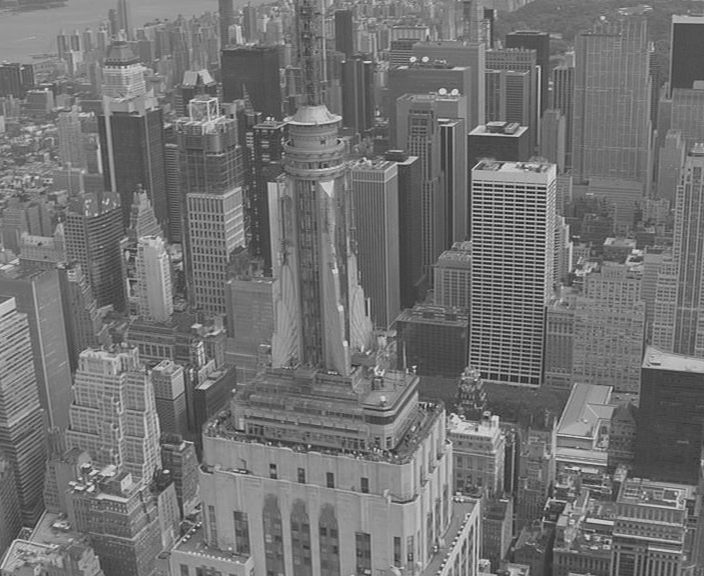

  

## Prediction of L2 model

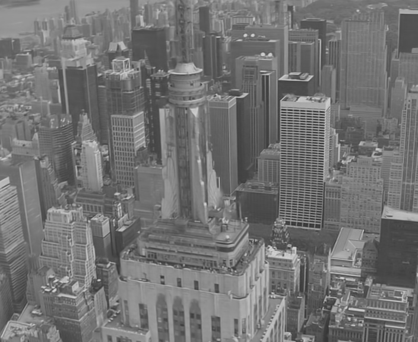

  

## Prediction of GAN model

  

# Coastguard - Frame 9

## Ground-truth

  

## Prediction of L2 model

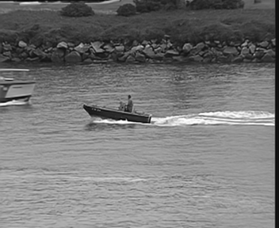

  

## Prediction of GAN model

  

# Container - Frame 9

## Ground-truth

  

## Prediction of L2 model

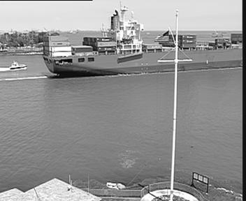

  

## Prediction of GAN model

  

# Football - Frame 9

## Ground-truth

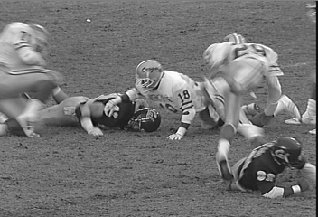

  

## Prediction of L2 model

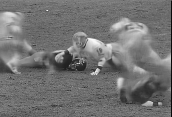

  

## Prediction of GAN model

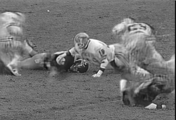

  

# Foreman - Frame 9

## Ground-truth

  

## Prediction of L2 model

  

## Prediction of GAN model

  

# Garden - Frame 9

## Ground-truth

  

## Prediction of L2 model

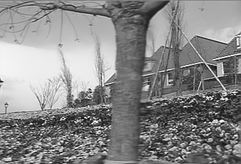

  

## Prediction of GAN model

  

# Hall monitor - Frame 9

## Ground-truth

  

## Prediction of L2 model

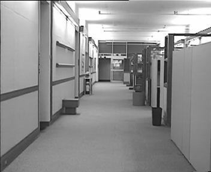

  

## Prediction of GAN model

  

# Harbour - Frame 9

## Ground-truth

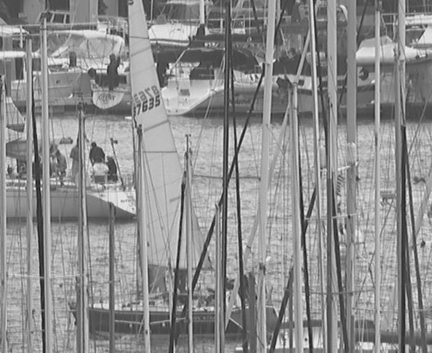

  

## Prediction of L2 model

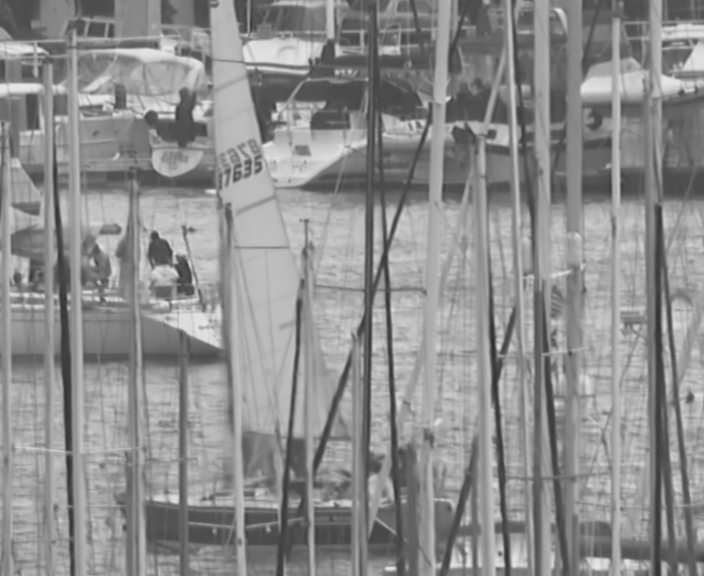

  

## Prediction of GAN model

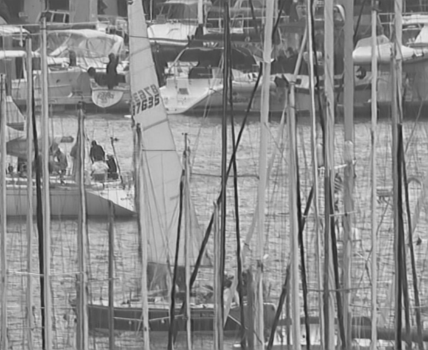

  

# Mobile - Frame 9

## Ground-truth

  

## Prediction of L2 model

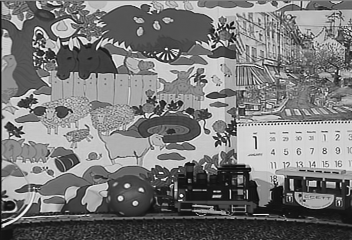

  

## Prediction of GAN model

  

# Tennis - Frame 9

## Ground-truth

  

## Prediction of L2 model

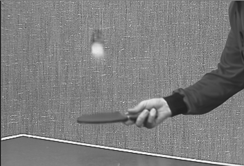

  

## Prediction of GAN model

  
